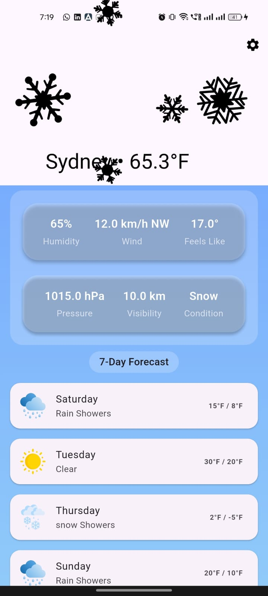
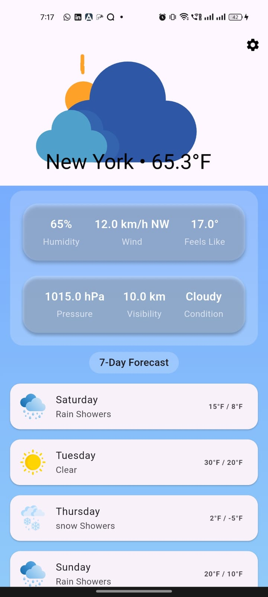
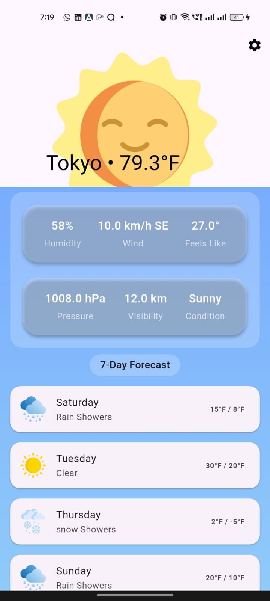
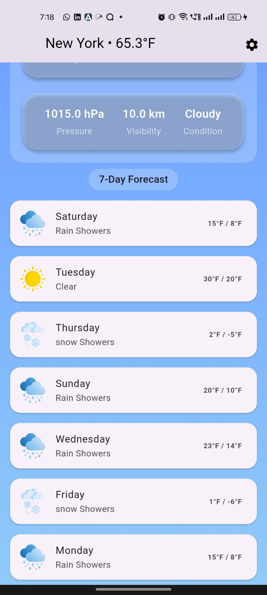
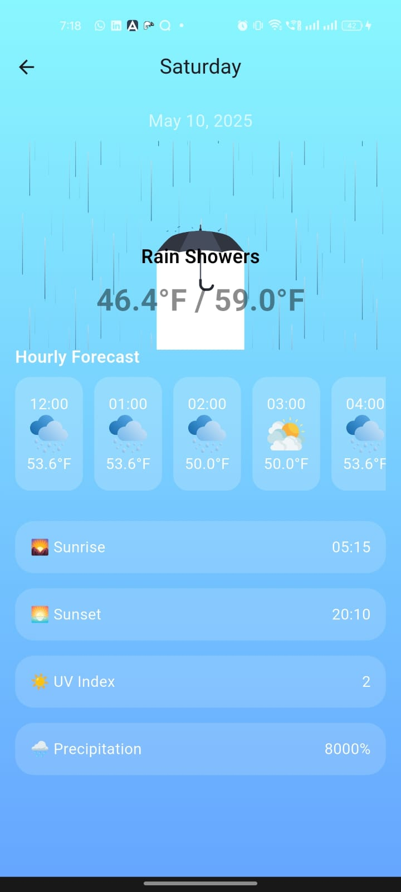
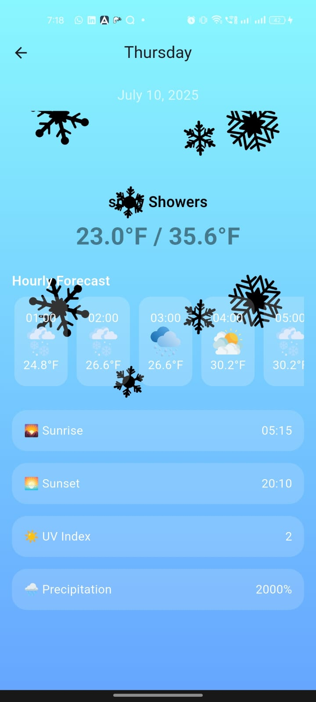
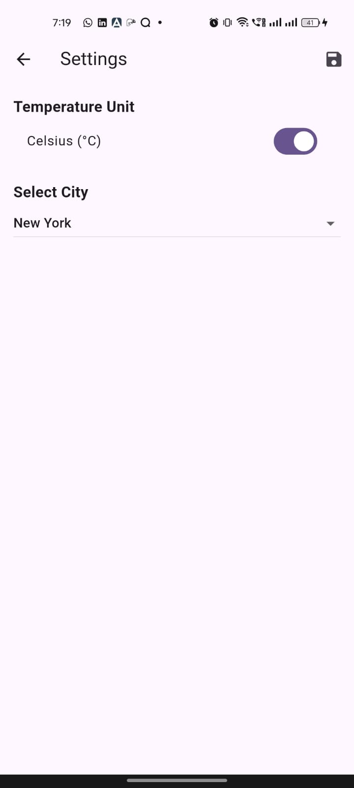
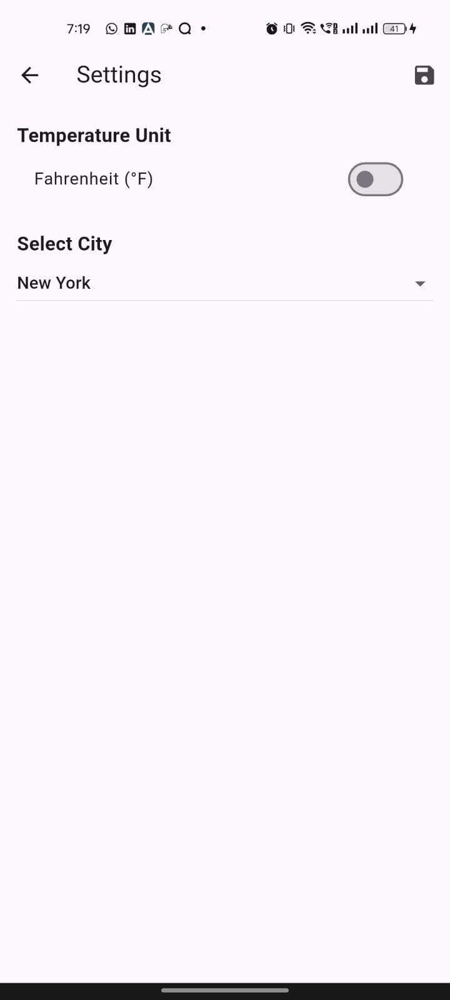
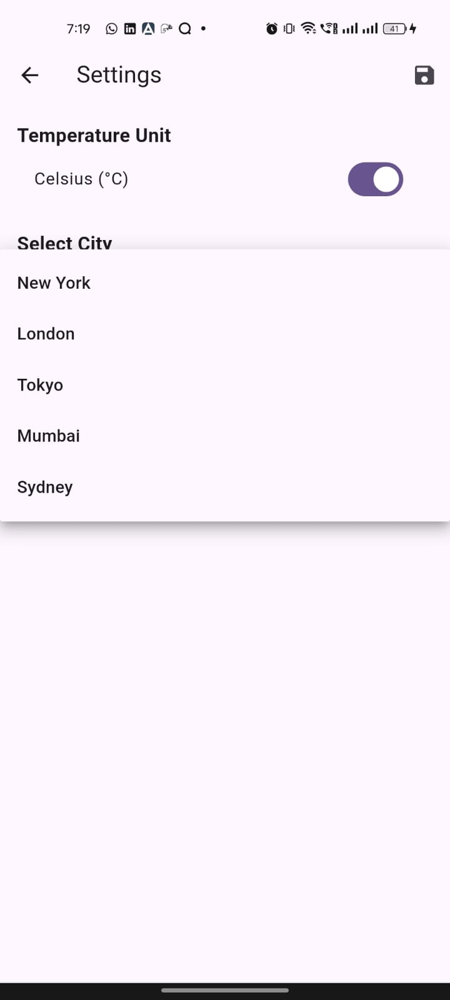

# 📰 Flutter Articles App

A clean and responsive Flutter app that fetches and displays a list of articles from a public API, with support for search, favorites, and offline persistence.

---

## 🚀 Features

- 🌇 7-Day weather forecast with animated weather background
- 🌡️ Toggle between Celsius and Fahrenheit
- 🏙️ City selection with offline data loading
- 🔁 Pull-to-refresh via mock weather JSON files
- 🎨 Dynamic UI using Material 3 and sliver-based scrolling
- 🧠 Persistent settings using `SharedPreferences`
- 💡 Clean, modular architecture with Provider and Freezed

---

## 🛠️ Setup Instructions

1. **Clone the repository**
   ```bash
   git clone https://github.com/palak-glitch/Weather-Forecast-UI
   cd Weather-Forecast-UI

2. Install dependencies:
   flutter pub get

4. Run the app:
   flutter run

5. To make part file for models
   flutter pub run build_runner build --delete-conflicting-outputs


## 🧰 Tech Stack
- Flutter SDK: =3.29.1
- State Management: provider
- Form Handling: reactive_forms
- Data Models: freezed and json_serializable
- UI Scrolling: CustomScrollView, SliverAppBar, SliverList, Material 3 Adaptive Layout
- Persistence: shared_preferences

🧩 Architecture
- Follows a clean and modular architecture:
- features/ for weather UI and logic
- data/ for models and mock JSON
- provider/ for app-level state
- utils/ for formatting and conversions
- router/ for navigation (via auto_route)

📦 State Management
- SettingsProvider holds city and temperature unit settings.
- Weather data is loaded from mock JSON based on the selected city.
- Changes in settings trigger UI and data reload.


## challenges faced
- To implement freezed_annotation as it was my 1st time using it. The error of missing implementation took some time.
- To implement auto_route as it was my 1st time using it. no implementation as no time left.

## Known Issues / Limitations
- 🌍 No live API — mock data only
- ❌ No error display UI on JSON read failure
- 🧪 No unit/integration tests yet
- 🌐 Locale-based formatting for symbols is basic 


## Screenshots (Optional)
[//]: # (![Home Screen]&#40;assets/1.jpg&#41;)

  
  
  
  
  
